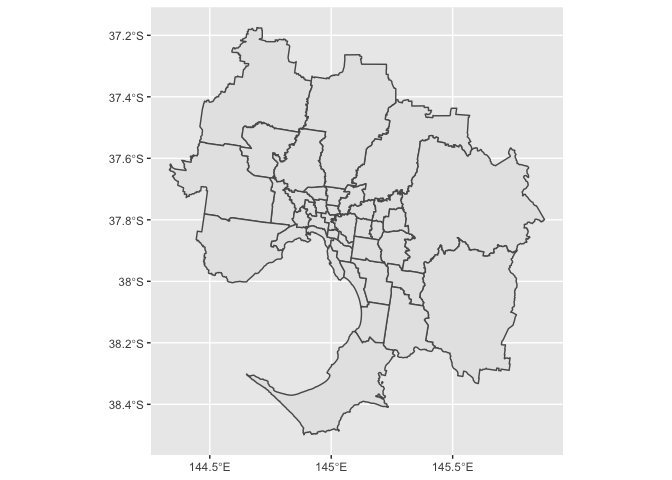
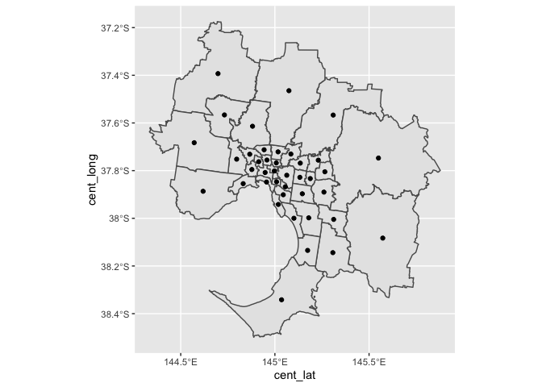
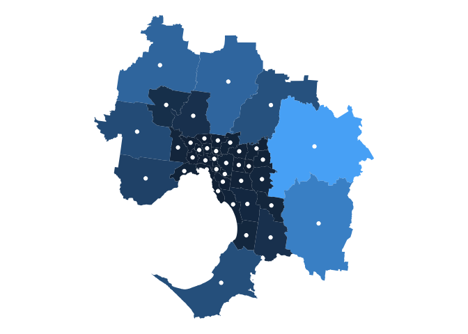
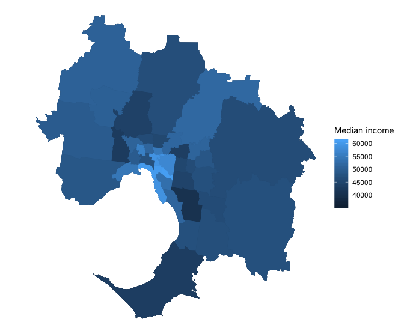

# absmapsdata

The `absmapsdata` package exists to make it easier to produce maps from
ABS data in R. The package contains compressed, tidied, and
lazily-loadable `sf` objects that hold geometric information about ABS
data structures.

It also contains a vast number of 2016 population-weighted ABS correspondences that you can access with the `get_correspondence_absmaps` function. The correspondences available can be found at the [data.gov.au website](https://data.gov.au/data/dataset/asgs-geographic-correspondences-2016/resource/951e18c7-f187-4c86-a73f-fcabcd19af16).

Before we get into the ‘what problem is this package solving’ details,
let’s look at some examples so that you can copy-paste into your own
script and replicate out-of-the-box (and impress your friends).

## Installation

You can install `absmapsdata` from github with:

``` r
# install.packages("remotes")
remotes::install_github("wfmackey/absmapsdata")
```

The `sf` package is required to handle the `sf` objects:
```r
# install.packages("sf")
library(sf)
```

And we will use the `tidyverse` packages in this example:

``` r
# install.packages("tidyverse")
library(tidyverse)
```

## Maps loaded with this package

Available maps are listed below. These will be added to over time. 
If you would like to request a map to be added, let me know via an issue on this Github repo.

**ASGS Main Structures**

* Statistical Area 1 2011: `sa12011`
* Statistical Area 1 2016: `sa12016`
* Statistical Area 2 2011: `sa22011`
* Statistical Area 2 2016: `sa22016`
* Statistical Area 3 2011: `sa32011`
* Statistical Area 3 2016: `sa32016`
* Statistical Area 4 2011: `sa42011`
* Statistical Area 4 2016: `sa42016`
* Greater Capital Cities 2011: `gcc2011`
* Greater Capital Cities 2016: `gcc2016`
* Remoteness Areas 2011: `ra2011`
* Remoteness Areas 2016: `ra2016`
* State 2011: `state2011`
* State 2016: `state2016`

**ASGS Non-ABS Structures**

* Commonwealth Electoral Divisions 2018: `ced2018`
* State Electoral Divisions 2018:`sed2018`
* Local Government Areas 2016: `lga2016`
* Local Government Areas 2018: `lga2018`
* Regions for the Internet Vacancy Index 2008: `regional_ivi2008`
* Postcodes 2016: `postcodes2016`
* Census of Population and Housing Destination Zones 2011: `dz2011`
* Census of Population and Housing Destination Zones 2016: `dz2016`


## Just show me how to make a map with this package

### Using the package’s pre-loaded data

The `absmapsdata` package comes with pre-downloaded and pre-processed
data. To load a particular geospatial object: load the **package**, then
call the object (see list above for object names).

``` r
library(tidyverse)
library(sf)
library(absmapsdata)

mapdata1 <- sa32011

glimpse(mapdata1)
#> Observations: 351
#> Variables: 12
#> $ sa3_code_2011   <chr> "10101", "10102", "10103", "10104", "10201", "10…
#> $ sa3_name_2011   <chr> "Goulburn - Yass", "Queanbeyan", "Snowy Mountain…
#> $ sa4_code_2011   <chr> "101", "101", "101", "101", "102", "102", "103",…
#> $ sa4_name_2011   <chr> "Capital Region", "Capital Region", "Capital Reg…
#> $ gcc_code_2011   <chr> "1RNSW", "1RNSW", "1RNSW", "1RNSW", "1GSYD", "1G…
#> $ gcc_name_2011   <chr> "Rest of NSW", "Rest of NSW", "Rest of NSW", "Re…
#> $ state_code_2011 <chr> "1", "1", "1", "1", "1", "1", "1", "1", "1", "1"…
#> $ state_name_2011 <chr> "New South Wales", "New South Wales", "New South…
#> $ albers_sqkm     <dbl> 21236.6140, 6511.1214, 14281.8301, 9864.9397, 98…
#> $ cent_long       <dbl> 149.0763, 149.6013, 148.9416, 149.8063, 151.2182…
#> $ cent_lat       <dbl> -34.55399, -35.44940, -36.43958, -36.49934, -33.…
#> $ geometry        <MULTIPOLYGON [°]> MULTIPOLYGON (((149.1198 -3..., MUL…
```

Or

``` r
mapdata2 <- sa22016

glimpse(mapdata2)
#> Observations: 2,310
#> Variables: 15
#> $ sa2_main_2016   <chr> "101021007", "101021008", "101021009", "10102101…
#> $ sa2_5dig_2016   <chr> "11007", "11008", "11009", "11010", "11011", "11…
#> $ sa2_name_2016   <chr> "Braidwood", "Karabar", "Queanbeyan", "Queanbeya…
#> $ sa3_code_2016   <chr> "10102", "10102", "10102", "10102", "10102", "10…
#> $ sa3_name_2016   <chr> "Queanbeyan", "Queanbeyan", "Queanbeyan", "Quean…
#> $ sa4_code_2016   <chr> "101", "101", "101", "101", "101", "101", "101",…
#> $ sa4_name_2016   <chr> "Capital Region", "Capital Region", "Capital Reg…
#> $ gcc_code_2016   <chr> "1RNSW", "1RNSW", "1RNSW", "1RNSW", "1RNSW", "1R…
#> $ gcc_name_2016   <chr> "Rest of NSW", "Rest of NSW", "Rest of NSW", "Re…
#> $ state_code_2016 <chr> "1", "1", "1", "1", "1", "1", "1", "1", "1", "1"…
#> $ state_name_2016 <chr> "New South Wales", "New South Wales", "New South…
#> $ areasqkm_2016   <dbl> 3418.3525, 6.9825, 4.7634, 13.0034, 3054.4099, 1…
#> $ cent_long       <dbl> 149.7932, 149.2328, 149.2255, 149.2524, 149.3911…
#> $ cent_lat        <dbl> -35.45508, -35.37590, -35.35103, -35.35520, -35.…
#> $ geometry        <MULTIPOLYGON [°]> MULTIPOLYGON (((149.7606 -3..., MUL…
```

The resulting `sf` object contains one observation per area (in the
following examples, one observation per `sa3`). It stores the geometry
information in the `geometry` variable, which is a nested list
describing the area’s polygon. The object can be joined to a standard
`data.frame` or `tibble` and can be used with `dplyr` functions.

### Creating maps with your `sf` object

We do all this so we can create gorgeous maps. And with the `sf` object
in hand, plotting a map via `ggplot` and `geom_sf` is simple.

``` r
map <-
sa32016 %>%
  filter(gcc_name_2016 == "Greater Melbourne") %>%   # let's just look Melbourne
  ggplot() +
  geom_sf(aes(geometry = geometry))  # use the geometry variable

map
```

<!-- -->

The data also include centroids of each area, and we can add these
points to the map with the `cent_lat` and `cent_long` variables using
`geom_point`.

``` r
map <-
sa32016 %>%
  filter(gcc_name_2016 == "Greater Melbourne") %>%   # let's just look Melbourne
  ggplot() +
  geom_sf(aes(geometry = geometry)) +   # use the geometry variable
  geom_point(aes(cent_long, cent_lat))  # use the centroid long (x) and lats (y)

map
```

<!-- -->

Cool. But, sidenote, this all looks a bit ugly. We can pretty it up
using `ggplot` tweaks. See the comments on each line for its objective.
Also note that we’re filling the areas by their `areasqkm` size, another
variable included in the `sf` object (we’ll replace this with more
interesting data in the next section).

``` r
map <-
sa32016 %>%
  filter(gcc_name_2016 == "Greater Melbourne") %>%   # let's just look Melbourne
  ggplot() +
  geom_sf(aes(geometry = geometry,  # use the geometry variable
              fill = areasqkm_2016),     # fill by area size
          lwd = 0,                  # remove borders
          show.legend = FALSE) +    # remove legend
  geom_point(aes(cent_long,
                 cent_lat),        # use the centroid long (x) and lats (y)
             colour = "white") +    # make the points white
  theme_void() +                    # clears other plot elements
  coord_sf()

map
```

<!-- -->

## Joining with other datasets

At some point, we’ll want to join our spatial data with
data-of-interest. The variables in our mapping data—stating the numeric
code and name of each area and parent area—will make this *relatively*
easy.

For example: suppose we had a simple dataset of median income by SA3
over time.

``` r
# Read data in some data

income <- read_csv("data/median_income_sa3.csv")

#> Parsed with column specification:
#> cols(
#>   sa3_name_2016 = col_character(),
#>   year = col_character(),
#>   median_income = col_double()
#> )
```

This income data contains a variable `sa3_name_2016`, and we can use
`dplyr::left_join()` to combine with our mapping data.

``` r
combined_data <- left_join(income, sa32016, by = "sa3_name_2016")
```

Now that we have a tidy dataset with 1) the income data we want to plot,
and 2) the geometry of the areas, we can plot income by area:

``` r
map <-
combined_data %>%
  filter(gcc_name_2016 == "Greater Melbourne") %>%   # let's just look Melbourne
  ggplot() +
  geom_sf(aes(geometry = geometry,  # use the geometry variable
              fill = median_income),        # fill by unemployment rate
          lwd = 0) +                # remove borders
  theme_void() +                    # clears other plot elements
  coord_sf(crs = "+init=epsg:4326") +       # sets the coordinate reference system (to match Google Earth)       
  labs(fill = "Median income")

map
```

<!-- -->

## Get correspondence files

You can use the `get_correspondence_absmaps` function to get population-weighted correspondence tables provided by the ABS (full details can be found at: https://data.gov.au/data/dataset/asgs-geographic-correspondences-2016/resource/951e18c7-f187-4c86-a73f-fcabcd19af16 ). 

For example:

``` r
get_correspondence_absmaps("cd", 2006,
                           "sa1", 2016)

#>     cd_code_2006 sa1_maincode_2016 sa1_7digitcode_2016     ratio
#> 1        1010101       10902117908             1117908 0.4770571
#> 2        1010101       10902117909             1117909 0.4857913
#> 3        1010101       10902117910             1117910 0.0371516
#> 4        1010102       10902117907             1117907 0.2101293
#> 5        1010102       10902117908             1117908 0.2806216
#> 6        1010102       10902117910             1117910 0.5092491


```


## Why does this package exist?

The motivation for this package is that maps are cool and fun and are,
sometimes, the best way to communicate data. And making maps is `R` with
`ggplot` is relatively easy *when you have the right `object`*.

Getting the right `object` is not technically difficult, but requires
research into the best-thing-to-do at each of the following steps:

  - Find the ASGS ABS spatial-data page and determine the right file to
    download.
  - Read the shapefile into `R` using one-of-many import tools.
  - Convert the object into something usable.
  - Clean up any inconsistencies and apply consistent variable
    naming/values across areas and years.
  - Find an appropriate compression function and level to optimise
    output.

For me, at least, finding the correct information and developing the
best set of steps was a little bit interesting but mostly tedious and
annoying. The `absmapsdata` package holds this data for you, so you can
spend more time making maps, and less time on Stack Overflow, the ABS
website, and [lovely-people’s wonderful
blogs](https://www.neonscience.org/dc-open-shapefiles-r).

## How does this package do the-things-it-does

The `absmapsdata` package simply holds compressed and easy to use data
(`sf` objects) for you use.

It is a data-only-based sibling of `absmaps`, which holds functionality
to download more shapefile data from the ABS and compress it to a level
you desire. However, this comes at a cost: the mapping software that
`absmaps` is built on can be a bit fiddly to install.

If you would like to do these things, please feel free to install
`absmaps`.

## I want to complain about this package

Fair enough\! The best avenue is via a Github issue at
(wfmackey/absmapsdata). This is also the best place to request data that
isn’t yet available in the package.


# Updates

2019-11-04 v1.2.1

- Added more correspondences from 2016 population-weighted file. Thanks to @gdickens for flagging that I'd missed some (many). 

2019-09-19 v1.2

- Added 2011 and 2016 destination zones. Thanks to @gabyd for suggesting this.

2019-08-06 v1.1

- Requires R >= 3.5.
- Correct `cent_lat` and `cent_long` variables in `sf` objects. Thanks to @jamesha95 for noticing this. 

