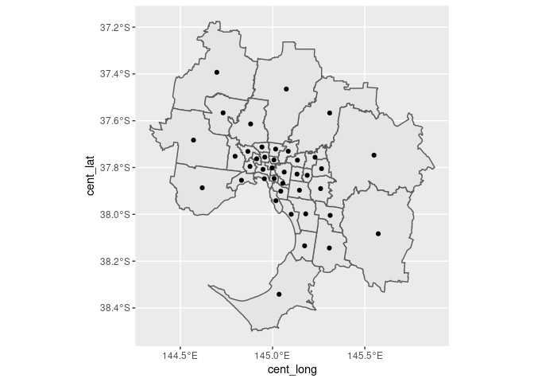
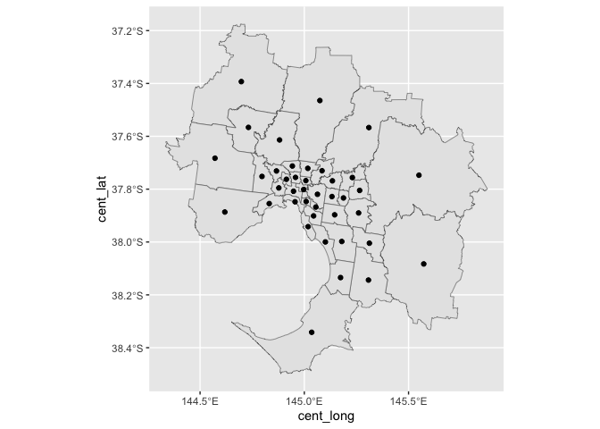
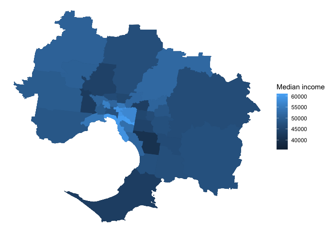

<!-- README.md is generated from README.Rmd. Please edit that file -->

> :warning: **This package is not owned, run, or endorsed by the ABS.**
> Data contained in this package are compressed, re-projected, renamed
> and stored as `sf` objects to be useful for making maps in R. If
> conducting spatial analysis, or any analysis that requires precise
> area boundaries, please use the original shapefiles provided by the
> ABS and others.

# absmapsdata

<!-- badges: start -->

[](https://www.tidyverse.org/lifecycle/#stable)
[](https://github.com/wfmackey/absmapsdata/actions)
<!-- badges: end -->

`absmapsdata` is a user-generated package to make it easier for R users
to access ABS (and other) spatial structure names/codes and produce maps
using this data. The package contains compressed (lossy), tidied, and
lazily-loadable `sf` objects that hold geometric information about data
structures in Australia. It also contains a correspondences files
provided by the ABS.

> :white_check_mark: **It is now recommended that you use
> [`strayr::read_absmap`](https://github.com/runapp-aus/strayr) to
> access data stored in `absmapsdata`**. To download and read these data
> files without installing the whole `absmapsdata` package, please use
> `strayr::read_absmap`, for example:

``` r
# remotes::install_github("runapp-aus/strayr")
strayr::read_absmap("sa42021")
#> Simple feature collection with 108 features and 9 fields (with 19 geometries empty)
#> Geometry type: MULTIPOLYGON
#> Dimension:     XY
#> Bounding box:  xmin: 96.81696 ymin: -43.74047 xmax: 167.9969 ymax: -9.219923
#> Geodetic CRS:  WGS 84
#> First 10 features:
#>    sa4_code_2021               sa4_name_2021 gcc_code_2021  gcc_name_2021 state_code_2021 state_name_2021 areasqkm_2021  cent_lat cent_long                       geometry
#> 1            101              Capital Region         1RNSW    Rest of NSW               1 New South Wales     51896.244 -35.55432  149.2427 MULTIPOLYGON (((150.3113 -3...
#> 2            102               Central Coast         1GSYD Greater Sydney               1 New South Wales      1681.009 -33.30788  151.2855 MULTIPOLYGON (((151.315 -33...
#> 3            103                Central West         1RNSW    Rest of NSW               1 New South Wales     70297.060 -33.21932  148.3585 MULTIPOLYGON (((150.6107 -3...
#> 4            104     Coffs Harbour - Grafton         1RNSW    Rest of NSW               1 New South Wales     13229.758 -29.81484  152.7740 MULTIPOLYGON (((153.2672 -3...
#> 5            105          Far West and Orana         1RNSW    Rest of NSW               1 New South Wales    339355.646 -30.99476  145.0285 MULTIPOLYGON (((150.1106 -3...
#> 6            106 Hunter Valley exc Newcastle         1RNSW    Rest of NSW               1 New South Wales     21491.292 -32.35426  150.9840 MULTIPOLYGON (((151.9978 -3...
#> 7            107                   Illawarra         1RNSW    Rest of NSW               1 New South Wales      1539.241 -34.43440  150.7712 MULTIPOLYGON (((150.8768 -3...
#> 8            108             Mid North Coast         1RNSW    Rest of NSW               1 New South Wales     18851.499 -31.56224  152.3435 MULTIPOLYGON (((159.0685 -3...
#> 9            109                      Murray         1RNSW    Rest of NSW               1 New South Wales     97796.490 -34.42239  144.0206 MULTIPOLYGON (((147.6165 -3...
#> 10           110  New England and North West         1RNSW    Rest of NSW               1 New South Wales     99139.900 -30.05970  150.7010 MULTIPOLYGON (((152.4876 -2...
```

## Installation

You probably don’t need to install the full `absmapsdata` package (see
above).

But if you want to, you can install `absmapsdata` from Github. The
package contains a lot of data, so installing using
`remotes::install_github` may fail if the download times out. If this
happens, set the timeout option to a large value and try again,
i.e. run:

``` r
options(timeout = 1000)
remotes::install_github("wfmackey/absmapsdata")
```

The `sf` package is required to handle the `sf` objects:

``` r
library(sf)
```

## Data loaded with this package

Available maps are listed below. These will be added to over time. If
you would like to request a map to be added, let me know via an issue on
this Github repo.

**ASGS Main Structures**

- Statistical Area 1 2011: `sa12011`; 2016: `sa12016`; and 2021:
  `sa12021`.
- Statistical Area 2 2011: `sa22011`; 2016: `sa22016`; and 2021:
  `sa22021`.
- Statistical Area 3 2011: `sa32011`; 2016: `sa32016`; and 2021:
  `sa32021`.
- Statistical Area 4 2011: `sa42011`; 2016: `sa42016`; and 2021:
  `sa42021`.
- Greater Capital Cities 2011: `gcc2011`; 2016: `gcc2016`; and 2021:
  `gcc2021`.
- Remoteness Areas 2011: `ra2011`; and 2016: `ra2016`
- State 2011: `state2011`; 2016: `state2016`; and `state2021`.

**ASGS Indigenous Structures**

- Indigenous Locations 2021: `iloc2021`
- Indigenous Areas 2021: `iare2021`
- Indigenous Regions 2021: `ireg2021`

**Significant Urban Areas and Urban Centres and Localities**

- Significant Urban Areas 2016: `sua2016`; and 2021: `sua2021`
- Urban Centre and Locality 2016: `ucl2016`; and 2021: `ucl2021`
- Section of State Range 2016: `sosr2016`
- Section of State 2016: `sos2016`

**ASGS Non-ABS Structures**

- Commonwealth Electoral Divisions 2018: `ced2018`; and 2021: `ced2021`
- State Electoral Divisions 2018:`sed2018`; 2021: `sed2021`; and 2022:
  `sed2022`
- Local Government Areas 2016: `lga2016`; 2018: `lga2018`; 2021:
  `lga2021`; and 2022: `lga2022`
- Regions for the Internet Vacancy Index 2008: `regional_ivi2008`
- Postcodes 2016: `postcode2016`; and 2021: `postcode2021`
- Suburbs (SSC) 2016: `suburb2016`; and (SAL) 2021: `suburb2021`
- Census of Population and Housing Destination Zones 2011: `dz2011`;
  2016: `dz2016`; and 2021: `dz2021`.

**Non-ABS Australian Government Structures**

- Employment Regions 2015-2020: `employment_regions2015`
- BITRE Working Zones 2016: `bitre_work_zones2016`
- NSW Local Health District 2023: `nsw_lhd2023`

**Correspondences**

This package also contains a number of 2016 population-weighted ABS
correspondences (the most recent) that can be found on the [data.gov.au
website](https://data.gov.au/data/dataset/asgs-geographic-correspondences-2016/resource/951e18c7-f187-4c86-a73f-fcabcd19af16).

> :white_check_mark: Use
> [`strayr::read_correspondence_tbl`](https://github.com/runapp-aus/strayr)
> to access correspondence this data, rather than loading the whole
> `absmapsdata` package, e.g.:

``` r
# remotes::install_github("runapp-aus/strayr")
strayr::read_correspondence_tbl(from_area = "sa2", from_year = 2011,
                                to_area = "sa2", to_year = 2016) 
#> # A tibble: 2,426 × 6
#>    SA2_MAINCODE_2011 SA2_NAME_2011     SA2_MAINCODE_2016 SA2_NAME_2016     ratio PERCENTAGE
#>    <chr>             <chr>             <chr>             <chr>             <dbl> <chr>     
#>  1 101011001         Goulburn          101051539         Goulburn              1 100       
#>  2 101011002         Goulburn Region   101051540         Goulburn Region       1 100       
#>  3 101011003         Yass              101061541         Yass                  1 100       
#>  4 101011004         Yass Region       101061542         Yass Region           1 100       
#>  5 101011005         Young             101061543         Young                 1 100       
#>  6 101011006         Young Region      101061544         Young Region          1 100       
#>  7 101021007         Braidwood         101021007         Braidwood             1 100       
#>  8 101021008         Karabar           101021008         Karabar               1 100       
#>  9 101021009         Queanbeyan        101021009         Queanbeyan            1 100       
#> 10 101021010         Queanbeyan - East 101021010         Queanbeyan - East     1 100       
#> # ℹ 2,416 more rows
```

Within `absmapsdata`, you can retrieve correspondences with the
`get_correspondence_absmaps` function.

## Just show me how to make a map with this package

### Using the package’s pre-loaded data

The `absmapsdata` package comes with pre-downloaded and pre-processed
data. To load a particular geospatial object: load the **package**, then
call the object (see list above for object names).

``` r
library(tidyverse)
library(sf)
library(absmapsdata)

mapdata1 <- sa32021

glimpse(mapdata1)
#> Rows: 359
#> Columns: 12
#> $ sa3_code_2021   <chr> "10102", "10103", "10104", "10105", "10106", "10201", "10202", "10301", "10302", "10303", "10304", "10401", "10402", "10501", "10502", "10503", "10601", "10602", "10603", "10604", "10701", "10702", "10703", "10704", "10801", "10802", "10803", "10804", "10805", "10901", "10902", "10903", "11001", "11002", "11003", "11004", "11101", "11102", "11103", "11201", "11202", "11203", "11301", "11302", "11303", "11401", "11402", "11501", "11502", "11503", "11504", "11601", "11602", "11603", "11701", "11702", "11703", "11801", "11802", "11901", "11902", "11903", "11904", "12001", "12002", "12003", "12101", "12102", "12103", "12104", "12201", "12202", "12203", "12301", "12302", "12303", "12401", "12402", "12403", "12404", "12405", "12501", "12502", "12503", "12504", "12601", "12602", "12701", "12702", "12703", "12801", "12802", "19797", "19999", "20101", "20102", "20103", "20201", "20202", "20203", "20301", "20302", "20303", "20401", "20402", "20403", "20501", "20502", "2…
#> $ sa3_name_2021   <chr> "Queanbeyan", "Snowy Mountains", "South Coast", "Goulburn - Mulwaree", "Young - Yass", "Gosford", "Wyong", "Bathurst", "Lachlan Valley", "Lithgow - Mudgee", "Orange", "Clarence Valley", "Coffs Harbour", "Bourke - Cobar - Coonamble", "Broken Hill and Far West", "Dubbo", "Lower Hunter", "Maitland", "Port Stephens", "Upper Hunter", "Dapto - Port Kembla", "Illawarra Catchment Reserve", "Kiama - Shellharbour", "Wollongong", "Great Lakes", "Kempsey - Nambucca", "Lord Howe Island", "Port Macquarie", "Taree - Gloucester", "Albury", "Lower Murray", "Upper Murray exc. Albury", "Armidale", "Inverell - Tenterfield", "Moree - Narrabri", "Tamworth - Gunnedah", "Lake Macquarie - East", "Lake Macquarie - West", "Newcastle", "Richmond Valley - Coastal", "Richmond Valley - Hinterland", "Tweed Valley", "Griffith - Murrumbidgee (West)", "Tumut - Tumbarumba", "Wagga Wagga", "Shoalhaven", "Southern Highlands", "Baulkham Hills", "Dural - Wisemans Ferry", "Hawkesbury", "Rouse Hill - …
#> $ sa4_code_2021   <chr> "101", "101", "101", "101", "101", "102", "102", "103", "103", "103", "103", "104", "104", "105", "105", "105", "106", "106", "106", "106", "107", "107", "107", "107", "108", "108", "108", "108", "108", "109", "109", "109", "110", "110", "110", "110", "111", "111", "111", "112", "112", "112", "113", "113", "113", "114", "114", "115", "115", "115", "115", "116", "116", "116", "117", "117", "117", "118", "118", "119", "119", "119", "119", "120", "120", "120", "121", "121", "121", "121", "122", "122", "122", "123", "123", "123", "124", "124", "124", "124", "124", "125", "125", "125", "125", "126", "126", "127", "127", "127", "128", "128", "197", "199", "201", "201", "201", "202", "202", "202", "203", "203", "203", "204", "204", "204", "205", "205", "205", "205", "205", "206", "206", "206", "206", "206", "206", "206", "207", "207", "207", "208", "208", "208", "208", "209", "209", "209", "209", "210", "210", "210", "210", "210", "211", "211", "211", "211", "211", "…
#> $ sa4_name_2021   <chr> "Capital Region", "Capital Region", "Capital Region", "Capital Region", "Capital Region", "Central Coast", "Central Coast", "Central West", "Central West", "Central West", "Central West", "Coffs Harbour - Grafton", "Coffs Harbour - Grafton", "Far West and Orana", "Far West and Orana", "Far West and Orana", "Hunter Valley exc Newcastle", "Hunter Valley exc Newcastle", "Hunter Valley exc Newcastle", "Hunter Valley exc Newcastle", "Illawarra", "Illawarra", "Illawarra", "Illawarra", "Mid North Coast", "Mid North Coast", "Mid North Coast", "Mid North Coast", "Mid North Coast", "Murray", "Murray", "Murray", "New England and North West", "New England and North West", "New England and North West", "New England and North West", "Newcastle and Lake Macquarie", "Newcastle and Lake Macquarie", "Newcastle and Lake Macquarie", "Richmond - Tweed", "Richmond - Tweed", "Richmond - Tweed", "Riverina", "Riverina", "Riverina", "Southern Highlands and Shoalhaven", "Southern Highla…
#> $ gcc_code_2021   <chr> "1RNSW", "1RNSW", "1RNSW", "1RNSW", "1RNSW", "1GSYD", "1GSYD", "1RNSW", "1RNSW", "1RNSW", "1RNSW", "1RNSW", "1RNSW", "1RNSW", "1RNSW", "1RNSW", "1RNSW", "1RNSW", "1RNSW", "1RNSW", "1RNSW", "1RNSW", "1RNSW", "1RNSW", "1RNSW", "1RNSW", "1RNSW", "1RNSW", "1RNSW", "1RNSW", "1RNSW", "1RNSW", "1RNSW", "1RNSW", "1RNSW", "1RNSW", "1RNSW", "1RNSW", "1RNSW", "1RNSW", "1RNSW", "1RNSW", "1RNSW", "1RNSW", "1RNSW", "1RNSW", "1RNSW", "1GSYD", "1GSYD", "1GSYD", "1GSYD", "1GSYD", "1GSYD", "1GSYD", "1GSYD", "1GSYD", "1GSYD", "1GSYD", "1GSYD", "1GSYD", "1GSYD", "1GSYD", "1GSYD", "1GSYD", "1GSYD", "1GSYD", "1GSYD", "1GSYD", "1GSYD", "1GSYD", "1GSYD", "1GSYD", "1GSYD", "1GSYD", "1GSYD", "1GSYD", "1GSYD", "1GSYD", "1GSYD", "1GSYD", "1GSYD", "1GSYD", "1GSYD", "1GSYD", "1GSYD", "1GSYD", "1GSYD", "1GSYD", "1GSYD", "1GSYD", "1GSYD", "1GSYD", "19799", "19499", "2RVIC", "2RVIC", "2RVIC", "2RVIC", "2RVIC", "2RVIC", "2RVIC", "2RVIC", "2RVIC", "2RVIC", "2RVIC", "2RVIC", "2RVIC", "2RVIC", "2…
#> $ gcc_name_2021   <chr> "Rest of NSW", "Rest of NSW", "Rest of NSW", "Rest of NSW", "Rest of NSW", "Greater Sydney", "Greater Sydney", "Rest of NSW", "Rest of NSW", "Rest of NSW", "Rest of NSW", "Rest of NSW", "Rest of NSW", "Rest of NSW", "Rest of NSW", "Rest of NSW", "Rest of NSW", "Rest of NSW", "Rest of NSW", "Rest of NSW", "Rest of NSW", "Rest of NSW", "Rest of NSW", "Rest of NSW", "Rest of NSW", "Rest of NSW", "Rest of NSW", "Rest of NSW", "Rest of NSW", "Rest of NSW", "Rest of NSW", "Rest of NSW", "Rest of NSW", "Rest of NSW", "Rest of NSW", "Rest of NSW", "Rest of NSW", "Rest of NSW", "Rest of NSW", "Rest of NSW", "Rest of NSW", "Rest of NSW", "Rest of NSW", "Rest of NSW", "Rest of NSW", "Rest of NSW", "Rest of NSW", "Greater Sydney", "Greater Sydney", "Greater Sydney", "Greater Sydney", "Greater Sydney", "Greater Sydney", "Greater Sydney", "Greater Sydney", "Greater Sydney", "Greater Sydney", "Greater Sydney", "Greater Sydney", "Greater Sydney", "Greater Sydney", "Greater Sy…
#> $ state_code_2021 <chr> "1", "1", "1", "1", "1", "1", "1", "1", "1", "1", "1", "1", "1", "1", "1", "1", "1", "1", "1", "1", "1", "1", "1", "1", "1", "1", "1", "1", "1", "1", "1", "1", "1", "1", "1", "1", "1", "1", "1", "1", "1", "1", "1", "1", "1", "1", "1", "1", "1", "1", "1", "1", "1", "1", "1", "1", "1", "1", "1", "1", "1", "1", "1", "1", "1", "1", "1", "1", "1", "1", "1", "1", "1", "1", "1", "1", "1", "1", "1", "1", "1", "1", "1", "1", "1", "1", "1", "1", "1", "1", "1", "1", "1", "1", "2", "2", "2", "2", "2", "2", "2", "2", "2", "2", "2", "2", "2", "2", "2", "2", "2", "2", "2", "2", "2", "2", "2", "2", "2", "2", "2", "2", "2", "2", "2", "2", "2", "2", "2", "2", "2", "2", "2", "2", "2", "2", "2", "2", "2", "2", "2", "2", "2", "2", "2", "2", "2", "2", "2", "2", "2", "2", "2", "2", "2", "2", "2", "2", "2", "2", "2", "2", "3", "3", "3", "3", "3", "3", "3", "3", "3", "3", "3", "3", "3", "3", "3", "3", "3", "3", "3", "3", "3", "3", "3", "3", "3", "3", "3", "3", "3", "3", "3", "3", "3",…
#> $ state_name_2021 <chr> "New South Wales", "New South Wales", "New South Wales", "New South Wales", "New South Wales", "New South Wales", "New South Wales", "New South Wales", "New South Wales", "New South Wales", "New South Wales", "New South Wales", "New South Wales", "New South Wales", "New South Wales", "New South Wales", "New South Wales", "New South Wales", "New South Wales", "New South Wales", "New South Wales", "New South Wales", "New South Wales", "New South Wales", "New South Wales", "New South Wales", "New South Wales", "New South Wales", "New South Wales", "New South Wales", "New South Wales", "New South Wales", "New South Wales", "New South Wales", "New South Wales", "New South Wales", "New South Wales", "New South Wales", "New South Wales", "New South Wales", "New South Wales", "New South Wales", "New South Wales", "New South Wales", "New South Wales", "New South Wales", "New South Wales", "New South Wales", "New South Wales", "New South Wales", "New South Wales", "New …
#> $ areasqkm_2021   <dbl> 6511.3971, 14284.5857, 9864.4876, 9099.9087, 12135.8653, 988.3863, 692.6225, 6984.1829, 41000.7206, 16044.6243, 6267.5322, 9263.1940, 3966.5637, 162762.4085, 146854.8470, 29738.3906, 8566.7812, 380.1169, 1071.9768, 11472.4168, 164.0176, 744.3423, 390.7982, 240.0824, 3133.0446, 5339.3246, 16.2918, 3687.7694, 6675.0682, 5597.0037, 63967.8828, 28231.6033, 16395.6494, 30566.4425, 32022.7204, 20155.0876, 138.0853, 507.6329, 224.8639, 1572.9178, 7390.6170, 1307.7853, 28859.6888, 9174.7261, 18950.5656, 4374.9473, 2330.0146, 72.0257, 569.2386, 2492.0101, 118.2237, 55.9289, 103.0657, 81.8889, 28.3677, 12.6700, 25.0658, 26.1862, 31.5480, 68.6675, 29.9648, 33.9469, 31.3480, 19.7477, 10.6577, 34.1437, 33.1733, 137.3989, 85.5463, 18.9809, 14.3455, 90.6494, 149.2123, 73.8692, 333.0123, 870.3606, 942.4079, 2456.9093, 356.8590, 178.8386, 33.1146, 33.0600, 25.6873, 56.9969, 47.0908, 22.1744, 47.1624, 291.5240, 123.7703, 124.9847, 55.6052, 240.2473, NA, NA, 448.3487, 3666.6730,…
#> $ cent_lat        <dbl> -35.44896, -36.43821, -36.49582, -34.51746, -34.57987, -33.36538, -33.22577, -33.62949, -33.32460, -32.73172, -33.27015, -29.61853, -30.27334, -30.72069, -31.08376, -31.85714, -32.62339, -32.70975, -32.69747, -32.10863, -34.48802, -34.36940, -34.64775, -34.25191, -32.33511, -30.86219, -31.55253, -31.41010, -31.84254, -35.76686, -33.86749, -35.39610, -30.72879, -29.44918, -29.64855, -31.08234, -33.02049, -33.04451, -32.87335, -28.86381, -28.78515, -28.35996, -34.06690, -35.73247, -34.91271, -35.07490, -34.49305, -33.73057, -33.54744, -33.30486, -33.62124, -33.76872, -33.69875, -33.77430, -33.94581, -33.91009, -33.88907, -33.88240, -33.94346, -33.92755, -33.92423, -33.96919, -33.95968, -33.85335, -33.87047, -33.88577, -33.80717, -33.62190, -33.73470, -33.83129, -33.80026, -33.63983, -33.71020, -34.05521, -34.07844, -34.14538, -33.63700, -33.99326, -33.80979, -33.62393, -33.78409, -33.85547, -33.79294, -33.84752, -33.79734, -33.75421, -33.80293, -33.94584, -33.86…
#> $ cent_long       <dbl> 149.6018, 148.9415, 149.8079, 149.6046, 148.6786, 151.2181, 151.3816, 149.6380, 147.4696, 149.8411, 148.9309, 152.7807, 152.7582, 146.4193, 142.7151, 148.8425, 151.2252, 151.5487, 151.9036, 150.7010, 150.7995, 150.7156, 150.7665, 150.9321, 152.1573, 152.6451, 159.0768, 152.5312, 152.0660, 147.1760, 143.2897, 145.0855, 151.7462, 151.3484, 149.6374, 150.5642, 151.6616, 151.4939, 151.7103, 153.4263, 152.9349, 153.3564, 145.8446, 148.2424, 147.4461, 150.3802, 150.3394, 150.9953, 151.0147, 150.7785, 150.8930, 150.9083, 150.8611, 150.8382, 151.2003, 151.1613, 151.1997, 151.2556, 151.2422, 151.0148, 151.0893, 151.0778, 151.1331, 151.1150, 151.1680, 151.1057, 151.1869, 151.1497, 151.1510, 151.2269, 151.2700, 151.2793, 151.2297, 150.7197, 150.8535, 150.6125, 150.4258, 150.2882, 150.6784, 150.7466, 150.7859, 151.0453, 151.0465, 150.9726, 150.9921, 151.0737, 151.1136, 150.7463, 150.8694, 150.9300, 151.1441, 151.0444, NA, NA, 143.8156, 144.1049, 143.5081, 144.2889, 144.35…
#> $ geometry        <MULTIPOLYGON [°]> MULTIPOLYGON (((149.979 -35..., MULTIPOLYGON (((149.0973 -3..., MULTIPOLYGON (((150.3345 -3..., MULTIPOLYGON (((149.0114 -3..., MULTIPOLYGON (((147.7137 -3..., MULTIPOLYGON (((151.315 -33..., MULTIPOLYGON (((151.485 -33..., MULTIPOLYGON (((149.323 -33..., MULTIPOLYGON (((149.1264 -3..., MULTIPOLYGON (((150.5587 -3..., MULTIPOLYGON (((148.3297 -3..., MULTIPOLYGON (((153.2785 -2..., MULTIPOLYGON (((153.2672 -3..., MULTIPOLYGON (((144.3929 -2..., MULTIPOLYGON (((140.9993 -2..., MULTIPOLYGON (((148.8107 -3..., MULTIPOLYGON (((151.406 -32..., MULTIPOLYGON (((151.6954 -3..., MULTIPOLYGON (((151.98 -32...., MULTIPOLYGON (((151.406 -32..., MULTIPOLYGON (((150.9291 -3..., MULTIPOLYGON (((150.8979 -3..., MULTIPOLYGON (((150.8768 -3..., MULTIPOLYGON (((150.8595 -3..., MULTIPOLYGON (((152.5444 -3..., MULTIPOLYGON (((153.0169 -3..., MULTIPOLYGON (((159.0685 -3..., MULTIPOLYGON (((152.9666 -3..., MULTIPOLYGON (((152.8044 -3..., MULTIPOLYGON (((147.756 -35..., M…
```

Or

``` r
mapdata2 <- sa22016

glimpse(mapdata2)
#> Rows: 2,310
#> Columns: 15
#> $ sa2_code_2016   <chr> "101021007", "101021008", "101021009", "101021010", "101021011", "101021012", "101031013", "101031014", "101031015", "101031016", "101041017", "101041018", "101041019", "101041020", "101041021", "101041022", "101041023", "101041024", "101041025", "101041026", "101041027", "101051539", "101051540", "101061541", "101061542", "101061543", "101061544", "102011028", "102011029", "102011030", "102011031", "102011032", "102011033", "102011034", "102011035", "102011036", "102011037", "102011038", "102011039", "102011040", "102011041", "102011042", "102011043", "102021044", "102021045", "102021046", "102021047", "102021048", "102021049", "102021050", "102021051", "102021052", "102021053", "102021054", "102021055", "102021056", "102021057", "103011058", "103011059", "103011060", "103011061", "103021062", "103021063", "103021064", "103021065", "103021066", "103021067", "103021068", "103021069", "103031070", "103031071", "103031072", "103031073", "103031074", "103031075",…
#> $ sa2_5dig_2016   <chr> "11007", "11008", "11009", "11010", "11011", "11012", "11013", "11014", "11015", "11016", "11017", "11018", "11019", "11020", "11021", "11022", "11023", "11024", "11025", "11026", "11027", "11539", "11540", "11541", "11542", "11543", "11544", "11028", "11029", "11030", "11031", "11032", "11033", "11034", "11035", "11036", "11037", "11038", "11039", "11040", "11041", "11042", "11043", "11044", "11045", "11046", "11047", "11048", "11049", "11050", "11051", "11052", "11053", "11054", "11055", "11056", "11057", "11058", "11059", "11060", "11061", "11062", "11063", "11064", "11065", "11066", "11067", "11068", "11069", "11070", "11071", "11072", "11073", "11074", "11075", "11076", "11077", "11078", "11079", "11080", "11081", "11082", "11083", "11084", "11085", "11086", "11087", "11088", "11089", "11090", "11091", "11092", "11093", "11094", "11095", "11096", "11097", "11098", "11099", "11100", "11101", "11102", "11103", "11104", "11105", "11106", "11107", "11108", "1…
#> $ sa2_name_2016   <chr> "Braidwood", "Karabar", "Queanbeyan", "Queanbeyan - East", "Queanbeyan Region", "Queanbeyan West - Jerrabomberra", "Bombala", "Cooma", "Cooma Region", "Jindabyne - Berridale", "Batemans Bay", "Batemans Bay - South", "Bega - Tathra", "Bega-Eden Hinterland", "Broulee - Tomakin", "Deua - Wadbilliga", "Eden", "Eurobodalla Hinterland", "Merimbula - Tura Beach", "Moruya - Tuross Head", "Narooma - Bermagui", "Goulburn", "Goulburn Region", "Yass", "Yass Region", "Young", "Young Region", "Avoca Beach - Copacabana", "Box Head - MacMasters Beach", "Calga - Kulnura", "Erina - Green Point", "Gosford - Springfield", "Kariong", "Kincumber - Picketts Valley", "Narara", "Niagara Park - Lisarow", "Point Clare - Koolewong", "Saratoga - Davistown", "Terrigal - North Avoca", "Umina - Booker Bay - Patonga", "Wamberal - Forresters Beach", "Woy Woy - Blackwall", "Wyoming", "Bateau Bay - Killarney Vale", "Blue Haven - San Remo", "Budgewoi - Buff Point - Halekulani", "Chittaway Bay - T…
#> $ sa3_code_2016   <chr> "10102", "10102", "10102", "10102", "10102", "10102", "10103", "10103", "10103", "10103", "10104", "10104", "10104", "10104", "10104", "10104", "10104", "10104", "10104", "10104", "10104", "10105", "10105", "10106", "10106", "10106", "10106", "10201", "10201", "10201", "10201", "10201", "10201", "10201", "10201", "10201", "10201", "10201", "10201", "10201", "10201", "10201", "10201", "10202", "10202", "10202", "10202", "10202", "10202", "10202", "10202", "10202", "10202", "10202", "10202", "10202", "10202", "10301", "10301", "10301", "10301", "10302", "10302", "10302", "10302", "10302", "10302", "10302", "10302", "10303", "10303", "10303", "10303", "10303", "10303", "10304", "10304", "10304", "10304", "10401", "10401", "10401", "10402", "10402", "10402", "10402", "10402", "10402", "10402", "10402", "10402", "10501", "10501", "10501", "10501", "10501", "10502", "10502", "10503", "10503", "10503", "10503", "10503", "10503", "10503", "10503", "10601", "10601", "1…
#> $ sa3_name_2016   <chr> "Queanbeyan", "Queanbeyan", "Queanbeyan", "Queanbeyan", "Queanbeyan", "Queanbeyan", "Snowy Mountains", "Snowy Mountains", "Snowy Mountains", "Snowy Mountains", "South Coast", "South Coast", "South Coast", "South Coast", "South Coast", "South Coast", "South Coast", "South Coast", "South Coast", "South Coast", "South Coast", "Goulburn - Mulwaree", "Goulburn - Mulwaree", "Young - Yass", "Young - Yass", "Young - Yass", "Young - Yass", "Gosford", "Gosford", "Gosford", "Gosford", "Gosford", "Gosford", "Gosford", "Gosford", "Gosford", "Gosford", "Gosford", "Gosford", "Gosford", "Gosford", "Gosford", "Gosford", "Wyong", "Wyong", "Wyong", "Wyong", "Wyong", "Wyong", "Wyong", "Wyong", "Wyong", "Wyong", "Wyong", "Wyong", "Wyong", "Wyong", "Bathurst", "Bathurst", "Bathurst", "Bathurst", "Lachlan Valley", "Lachlan Valley", "Lachlan Valley", "Lachlan Valley", "Lachlan Valley", "Lachlan Valley", "Lachlan Valley", "Lachlan Valley", "Lithgow - Mudgee", "Lithgow - Mudgee", "Lith…
#> $ sa4_code_2016   <chr> "101", "101", "101", "101", "101", "101", "101", "101", "101", "101", "101", "101", "101", "101", "101", "101", "101", "101", "101", "101", "101", "101", "101", "101", "101", "101", "101", "102", "102", "102", "102", "102", "102", "102", "102", "102", "102", "102", "102", "102", "102", "102", "102", "102", "102", "102", "102", "102", "102", "102", "102", "102", "102", "102", "102", "102", "102", "103", "103", "103", "103", "103", "103", "103", "103", "103", "103", "103", "103", "103", "103", "103", "103", "103", "103", "103", "103", "103", "103", "104", "104", "104", "104", "104", "104", "104", "104", "104", "104", "104", "104", "105", "105", "105", "105", "105", "105", "105", "105", "105", "105", "105", "105", "105", "105", "105", "106", "106", "106", "106", "106", "106", "106", "106", "106", "106", "106", "106", "106", "106", "106", "106", "106", "106", "106", "106", "106", "106", "106", "107", "107", "107", "107", "107", "107", "107", "107", "107", "107", "…
#> $ sa4_name_2016   <chr> "Capital Region", "Capital Region", "Capital Region", "Capital Region", "Capital Region", "Capital Region", "Capital Region", "Capital Region", "Capital Region", "Capital Region", "Capital Region", "Capital Region", "Capital Region", "Capital Region", "Capital Region", "Capital Region", "Capital Region", "Capital Region", "Capital Region", "Capital Region", "Capital Region", "Capital Region", "Capital Region", "Capital Region", "Capital Region", "Capital Region", "Capital Region", "Central Coast", "Central Coast", "Central Coast", "Central Coast", "Central Coast", "Central Coast", "Central Coast", "Central Coast", "Central Coast", "Central Coast", "Central Coast", "Central Coast", "Central Coast", "Central Coast", "Central Coast", "Central Coast", "Central Coast", "Central Coast", "Central Coast", "Central Coast", "Central Coast", "Central Coast", "Central Coast", "Central Coast", "Central Coast", "Central Coast", "Central Coast", "Central Coast", "Central Coa…
#> $ gcc_code_2016   <chr> "1RNSW", "1RNSW", "1RNSW", "1RNSW", "1RNSW", "1RNSW", "1RNSW", "1RNSW", "1RNSW", "1RNSW", "1RNSW", "1RNSW", "1RNSW", "1RNSW", "1RNSW", "1RNSW", "1RNSW", "1RNSW", "1RNSW", "1RNSW", "1RNSW", "1RNSW", "1RNSW", "1RNSW", "1RNSW", "1RNSW", "1RNSW", "1GSYD", "1GSYD", "1GSYD", "1GSYD", "1GSYD", "1GSYD", "1GSYD", "1GSYD", "1GSYD", "1GSYD", "1GSYD", "1GSYD", "1GSYD", "1GSYD", "1GSYD", "1GSYD", "1GSYD", "1GSYD", "1GSYD", "1GSYD", "1GSYD", "1GSYD", "1GSYD", "1GSYD", "1GSYD", "1GSYD", "1GSYD", "1GSYD", "1GSYD", "1GSYD", "1RNSW", "1RNSW", "1RNSW", "1RNSW", "1RNSW", "1RNSW", "1RNSW", "1RNSW", "1RNSW", "1RNSW", "1RNSW", "1RNSW", "1RNSW", "1RNSW", "1RNSW", "1RNSW", "1RNSW", "1RNSW", "1RNSW", "1RNSW", "1RNSW", "1RNSW", "1RNSW", "1RNSW", "1RNSW", "1RNSW", "1RNSW", "1RNSW", "1RNSW", "1RNSW", "1RNSW", "1RNSW", "1RNSW", "1RNSW", "1RNSW", "1RNSW", "1RNSW", "1RNSW", "1RNSW", "1RNSW", "1RNSW", "1RNSW", "1RNSW", "1RNSW", "1RNSW", "1RNSW", "1RNSW", "1RNSW", "1RNSW", "1RNSW", "1RNSW", "1…
#> $ gcc_name_2016   <chr> "Rest of NSW", "Rest of NSW", "Rest of NSW", "Rest of NSW", "Rest of NSW", "Rest of NSW", "Rest of NSW", "Rest of NSW", "Rest of NSW", "Rest of NSW", "Rest of NSW", "Rest of NSW", "Rest of NSW", "Rest of NSW", "Rest of NSW", "Rest of NSW", "Rest of NSW", "Rest of NSW", "Rest of NSW", "Rest of NSW", "Rest of NSW", "Rest of NSW", "Rest of NSW", "Rest of NSW", "Rest of NSW", "Rest of NSW", "Rest of NSW", "Greater Sydney", "Greater Sydney", "Greater Sydney", "Greater Sydney", "Greater Sydney", "Greater Sydney", "Greater Sydney", "Greater Sydney", "Greater Sydney", "Greater Sydney", "Greater Sydney", "Greater Sydney", "Greater Sydney", "Greater Sydney", "Greater Sydney", "Greater Sydney", "Greater Sydney", "Greater Sydney", "Greater Sydney", "Greater Sydney", "Greater Sydney", "Greater Sydney", "Greater Sydney", "Greater Sydney", "Greater Sydney", "Greater Sydney", "Greater Sydney", "Greater Sydney", "Greater Sydney", "Greater Sydney", "Rest of NSW", "Rest of NSW",…
#> $ state_code_2016 <chr> "1", "1", "1", "1", "1", "1", "1", "1", "1", "1", "1", "1", "1", "1", "1", "1", "1", "1", "1", "1", "1", "1", "1", "1", "1", "1", "1", "1", "1", "1", "1", "1", "1", "1", "1", "1", "1", "1", "1", "1", "1", "1", "1", "1", "1", "1", "1", "1", "1", "1", "1", "1", "1", "1", "1", "1", "1", "1", "1", "1", "1", "1", "1", "1", "1", "1", "1", "1", "1", "1", "1", "1", "1", "1", "1", "1", "1", "1", "1", "1", "1", "1", "1", "1", "1", "1", "1", "1", "1", "1", "1", "1", "1", "1", "1", "1", "1", "1", "1", "1", "1", "1", "1", "1", "1", "1", "1", "1", "1", "1", "1", "1", "1", "1", "1", "1", "1", "1", "1", "1", "1", "1", "1", "1", "1", "1", "1", "1", "1", "1", "1", "1", "1", "1", "1", "1", "1", "1", "1", "1", "1", "1", "1", "1", "1", "1", "1", "1", "1", "1", "1", "1", "1", "1", "1", "1", "1", "1", "1", "1", "1", "1", "1", "1", "1", "1", "1", "1", "1", "1", "1", "1", "1", "1", "1", "1", "1", "1", "1", "1", "1", "1", "1", "1", "1", "1", "1", "1", "1", "1", "1", "1", "1", "1", "1",…
#> $ state_name_2016 <chr> "New South Wales", "New South Wales", "New South Wales", "New South Wales", "New South Wales", "New South Wales", "New South Wales", "New South Wales", "New South Wales", "New South Wales", "New South Wales", "New South Wales", "New South Wales", "New South Wales", "New South Wales", "New South Wales", "New South Wales", "New South Wales", "New South Wales", "New South Wales", "New South Wales", "New South Wales", "New South Wales", "New South Wales", "New South Wales", "New South Wales", "New South Wales", "New South Wales", "New South Wales", "New South Wales", "New South Wales", "New South Wales", "New South Wales", "New South Wales", "New South Wales", "New South Wales", "New South Wales", "New South Wales", "New South Wales", "New South Wales", "New South Wales", "New South Wales", "New South Wales", "New South Wales", "New South Wales", "New South Wales", "New South Wales", "New South Wales", "New South Wales", "New South Wales", "New South Wales", "New …
#> $ areasqkm_2016   <dbl> 3418.3525, 6.9825, 4.7634, 13.0034, 3054.4099, 13.6789, 3989.3618, 103.6371, 6250.8748, 3939.5484, 63.7074, 30.5948, 183.8985, 4710.2068, 24.2329, 2781.9988, 94.8138, 1460.0117, 97.3395, 165.4118, 252.6520, 64.7865, 9035.1221, 99.7342, 5680.8782, 505.7528, 5849.8086, 6.4376, 32.0860, 767.9512, 33.7934, 16.9124, 8.3063, 12.0887, 7.7021, 16.7316, 6.7874, 4.7683, 10.1073, 25.2284, 13.7221, 17.4225, 8.3810, 10.8595, 20.9797, 9.3531, 24.4986, 11.2490, 346.7662, 35.4946, 114.1172, 9.1793, 13.8576, 10.5216, 27.8463, 42.8900, 15.0334, 119.5048, 94.0341, 3798.2628, 2972.3813, 15858.8501, 242.2010, 3037.1557, 4598.0438, 3294.0766, 234.7556, 5418.1649, 8317.4729, 119.9844, 2514.0700, 65.8948, 2852.0843, 8043.8635, 2448.7276, 1642.6748, 45.2499, 99.5118, 4480.0957, 106.2537, 8445.8909, 711.0493, 1001.0481, 25.6688, 33.6996, 363.9090, 1987.6714, 57.6881, 118.2251, 108.4124, 270.2414, 56843.6928, 45551.3981, 12142.3534, 21216.0023, 27011.6794, 170.1153, 146690.0605, 10474.1…
#> $ cent_long       <dbl> 149.7932, 149.2328, 149.2255, 149.2524, 149.3911, 149.2028, 149.0455, 149.1194, 149.0822, 148.6089, 150.1819, 150.2104, 149.9021, 149.7191, 150.1616, 149.7464, 149.8909, 150.0722, 149.8821, 150.1072, 150.0737, 149.7196, 149.6046, 148.9159, 148.8932, 148.3531, 148.4956, 151.4302, 151.3847, 151.1753, 151.4026, 151.3479, 151.2946, 151.4031, 151.3341, 151.3728, 151.3163, 151.3577, 151.4280, 151.2982, 151.4499, 151.3057, 151.3641, 151.4674, 151.5242, 151.5609, 151.4283, 151.4948, 151.3241, 151.5759, 151.3351, 151.5769, 151.5120, 151.5546, 151.4121, 151.4581, 151.4353, 149.5589, 149.6292, 149.5330, 149.7757, 147.0338, 148.6611, 148.6829, 147.9249, 148.0259, 148.1899, 148.0015, 146.9843, 150.1248, 150.0514, 149.6012, 150.0281, 149.5433, 150.3854, 149.1439, 149.1126, 149.1259, 148.8476, 152.9354, 152.7379, 153.2662, 152.7199, 153.1042, 153.0957, 153.0329, 152.6205, 153.1406, 153.0371, 152.9991, 153.1669, 145.7465, 145.4847, 148.2240, 147.0807, 148.0662, 141.4793, 142.…
#> $ cent_lat        <dbl> -35.45508, -35.37590, -35.35103, -35.35520, -35.44408, -35.37760, -36.87794, -36.25023, -36.12715, -36.49170, -35.70108, -35.78418, -36.72504, -36.92872, -35.84601, -36.17742, -37.03135, -35.77465, -36.90019, -35.94713, -36.31306, -34.75057, -34.51647, -34.82284, -34.87668, -34.32114, -34.30978, -33.47548, -33.50845, -33.33970, -33.42324, -33.42524, -33.43976, -33.46983, -33.39606, -33.38428, -33.44820, -33.47745, -33.44511, -33.52917, -33.40970, -33.48517, -33.40474, -33.37960, -33.20405, -33.22673, -33.35442, -33.25791, -33.17296, -33.18047, -33.31651, -33.14104, -33.32910, -33.27305, -33.30483, -33.24205, -33.27656, -33.39912, -33.41528, -33.44042, -33.88803, -32.90815, -33.79104, -33.74021, -33.46160, -33.87923, -33.17294, -32.95368, -33.90016, -33.47862, -33.30741, -32.60394, -32.74829, -32.40578, -33.16048, -33.60788, -33.30131, -33.24941, -33.14654, -29.67722, -29.63487, -29.42054, -30.44796, -30.28213, -30.31514, -30.20839, -30.21362, -30.20613, -30.37…
#> $ geometry        <MULTIPOLYGON [°]> MULTIPOLYGON (((149.7606 -3..., MULTIPOLYGON (((149.2192 -3..., MULTIPOLYGON (((149.2315 -3..., MULTIPOLYGON (((149.2315 -3..., MULTIPOLYGON (((149.2563 -3..., MULTIPOLYGON (((149.2064 -3..., MULTIPOLYGON (((148.4221 -3..., MULTIPOLYGON (((149.0751 -3..., MULTIPOLYGON (((148.5512 -3..., MULTIPOLYGON (((148.5512 -3..., MULTIPOLYGON (((150.1978 -3..., MULTIPOLYGON (((150.2336 -3..., MULTIPOLYGON (((149.9931 -3..., MULTIPOLYGON (((150.0238 -3..., MULTIPOLYGON (((150.1987 -3..., MULTIPOLYGON (((150.046 -36..., MULTIPOLYGON (((149.9129 -3..., MULTIPOLYGON (((149.979 -35..., MULTIPOLYGON (((149.9368 -3..., MULTIPOLYGON (((150.1196 -3..., MULTIPOLYGON (((150.2307 -3..., MULTIPOLYGON (((149.6879 -3..., MULTIPOLYGON (((149.08 -34...., MULTIPOLYGON (((148.8828 -3..., MULTIPOLYGON (((149.08 -34...., MULTIPOLYGON (((148.2258 -3..., MULTIPOLYGON (((147.8245 -3..., MULTIPOLYGON (((151.414 -33..., MULTIPOLYGON (((151.3799 -3..., MULTIPOLYGON (((151.2046 -3..., M…
```

The resulting `sf` object contains one observation per area (in the
following examples, one observation per `sa3`). It stores the geometry
information in the `geometry` variable, which is a nested list
describing the area’s polygon. The object can be joined to a standard
`data.frame` or `tibble` and can be used with `dplyr` functions.

### Creating maps with your `sf` object

We do all this so we can create gorgeous maps. And with the `sf` object
in hand, plotting a map via `ggplot` and `geom_sf` is simple.

``` r
map <-
sa32016 %>%
  filter(gcc_name_2016 == "Greater Melbourne") %>%   # let's just look Melbourne
  ggplot() +
  geom_sf(aes(geometry = geometry))  # use the geometry variable

map
```



The data also include centroids of each area, and we can add these
points to the map with the `cent_lat` and `cent_long` variables using
`geom_point`.

``` r
map <- sa32016 %>%
  filter(gcc_name_2016 == "Greater Melbourne") %>%   # let's just look Melbourne
  ggplot() +
  geom_sf(aes(geometry = geometry)) +   # use the geometry variable
  geom_point(aes(cent_long, cent_lat))  # use the centroid long (x) and lats (y)

map
```



Cool. But this all looks a bit ugly. We can pretty it up using `ggplot`
tweaks. See the comments on each line for its objective. Also note that
we’re filling the areas by their `areasqkm` size, another variable
included in the `sf` object (we’ll replace this with more interesting
data in the next section).

``` r
map <- sa32016 %>%
  filter(gcc_name_2016 == "Greater Melbourne") %>%   # let's just look Melbourne
  ggplot() +
  geom_sf(aes(geometry = geometry,  # use the geometry variable
              fill = areasqkm_2016),     # fill by area size
          lwd = 0,                  # remove borders
          show.legend = FALSE) +    # remove legend
  geom_point(aes(cent_long,
                 cent_lat),        # use the centroid long (x) and lats (y)
             colour = "white") +    # make the points white
  theme_void() +                    # clears other plot elements
  coord_sf()

map
```


## Joining with other datasets

At some point, we’ll want to join our spatial data with
data-of-interest. The variables in our mapping data—stating the numeric
code and name of each area and parent area—will make this *relatively*
easy.

For example: suppose we had a simple dataset of median income by SA3
over time.

``` r
# Read data in some data
income <- read_csv("https://raw.githubusercontent.com/wfmackey/absmapsdata/master/img/data/median_income_sa3.csv")
#> Rows: 2148 Columns: 3
#> ── Column specification ────────────────────────────────────────────────────────────────────────────────────────────────────────────────────────────────────────────────────────────────────────────────────────────────────────────────────────────────────────────────────────────────────────────────────────────────────────────────────────────────────────────────────────────────────────────────────────────────────────────────────────────────────────────────────────────────────────────────────────────────────────────────────────────────────────────────────────────────────────────────────────────────────────────────────────────────────────────────────────────────────────────────────────────────────────────────────────────────────────────────────────────────────────────────────────────────────────────────────────────────────────────────────────────────────────────────────────────────────────────────────────────────────────────────────────────────────────────────────────────────────────────────
#> Delimiter: ","
#> chr (2): sa3_name_2016, year
#> dbl (1): median_income
#> 
#> ℹ Use `spec()` to retrieve the full column specification for this data.
#> ℹ Specify the column types or set `show_col_types = FALSE` to quiet this message.
head(income)
#> # A tibble: 6 × 3
#>   sa3_name_2016       year    median_income
#>   <chr>               <chr>           <dbl>
#> 1 Queanbeyan          2010-11         51858
#> 2 Snowy Mountains     2010-11         35884
#> 3 South Coast         2010-11         30908
#> 4 Goulburn - Mulwaree 2010-11         38269
#> 5 Young - Yass        2010-11         39489
#> 6 Gosford             2010-11         38189
```

This income data contains a variable `sa3_name_2016`, and we can use
`dplyr::left_join()` to combine with our mapping data.

``` r
combined_data <- left_join(income, 
                           sa32016, 
                           by = "sa3_name_2016")
```

Now that we have a tidy dataset with 1) the income data we want to plot,
and 2) the geometry of the areas, we can plot income by area:

``` r
map <- combined_data %>%
  filter(gcc_name_2016 == "Greater Melbourne") %>%   # let's just look Melbourne
  ggplot() +
  geom_sf(aes(geometry = geometry,   # use the geometry variable
              fill = median_income), # fill by unemployment rate
          lwd = 0) +                 # remove borders
  theme_void() +                     # clears other plot elements
  labs(fill = "Median income")

map
```



## Get correspondence files

> :white_check_mark: Use
> [`strayr::read_correspondence_tbl`](https://github.com/runapp-aus/strayr)
> to access correspondence this data, rather than loading the whole
> `absmapsdata` package, e.g.:

``` r
# remotes::install_github("runapp-aus/strayr")
strayr::read_correspondence_tbl(from_area = "sa2", from_year = 2011,
                                to_area = "sa2", to_year = 2016) 
#> Reading file found in /var/folders/98/c8srjgc55kbfzlrnl3c9yy2w0000gn/T//RtmpyJ9yUb
#> # A tibble: 2,426 × 6
#>    SA2_MAINCODE_2011 SA2_NAME_2011     SA2_MAINCODE_2016 SA2_NAME_2016     ratio PERCENTAGE
#>    <chr>             <chr>             <chr>             <chr>             <dbl> <chr>     
#>  1 101011001         Goulburn          101051539         Goulburn              1 100       
#>  2 101011002         Goulburn Region   101051540         Goulburn Region       1 100       
#>  3 101011003         Yass              101061541         Yass                  1 100       
#>  4 101011004         Yass Region       101061542         Yass Region           1 100       
#>  5 101011005         Young             101061543         Young                 1 100       
#>  6 101011006         Young Region      101061544         Young Region          1 100       
#>  7 101021007         Braidwood         101021007         Braidwood             1 100       
#>  8 101021008         Karabar           101021008         Karabar               1 100       
#>  9 101021009         Queanbeyan        101021009         Queanbeyan            1 100       
#> 10 101021010         Queanbeyan - East 101021010         Queanbeyan - East     1 100       
#> # ℹ 2,416 more rows
```

You can use the `absmapsdata::get_correspondence_absmaps` function to
get population-weighted correspondence tables provided [by the
ABS](https://data.gov.au/data/dataset/asgs-geographic-correspondences-2016/resource/951e18c7-f187-4c86-a73f-fcabcd19af16).
Note that while there are lots of correspondence tables, not every
combination is available.

For example:

``` r
get_correspondence_absmaps("cd", 2006,
                           "sa1", 2016)
#> # A tibble: 92,336 × 5
#>    CD_CODE_2006 SA1_MAINCODE_2016 SA1_7DIGITCODE_2016  ratio PERCENTAGE        
#>    <chr>        <chr>             <chr>                <dbl> <chr>             
#>  1 1010101      10902117908       1117908             0.477  47.705709900000002
#>  2 1010101      10902117909       1117909             0.486  48.579130499999998
#>  3 1010101      10902117910       1117910             0.0372 3.7151597000000001
#>  4 1010102      10902117907       1117907             0.210  21.012930999999998
#>  5 1010102      10902117908       1117908             0.281  28.062155199999999
#>  6 1010102      10902117910       1117910             0.509  50.924913799999999
#>  7 1010103      10902117907       1117907             1      100               
#>  8 1010104      10902117901       1117901             0.510  51.007496400000001
#>  9 1010104      10902117907       1117907             0.490  48.992503599999999
#> 10 1010105      10902117907       1117907             1      100               
#> # ℹ 92,326 more rows
```

## Why does this package exist?

The motivation for this package is that maps are cool and fun and are,
sometimes, the best way to communicate data. And making maps is `R` with
`ggplot` is relatively easy *when you have the right `object`*.

Getting the right `object` is not technically difficult, but requires
research into the best-thing-to-do at each of the following steps:

- Find the ASGS ABS spatial-data page and determine the right file to
  download.
- Read the shapefile into `R` using one-of-many import tools.
- Convert the object into something usable.
- Clean up any inconsistencies and apply consistent variable
  naming/values across areas and years.
- Find an appropriate compression function and level to optimise output.

For me at least, finding the correct information and developing the best
set of steps was a little bit interesting but mostly tedious and
annoying. The `absmapsdata` package holds this data for you, so you can
spend more time making maps, and less time on Stack Overflow, the ABS
website, and [lovely-people’s wonderful
blogs](https://www.neonscience.org/dc-open-shapefiles-r).

## Comments/complaints/requests

The best avenue is via a Github issue at
[wfmackey/absmapsdata/issues](https://github.com/wfmackey/absmapsdata/issues).
This is also the best place to request data that isn’t yet available in
the package.
